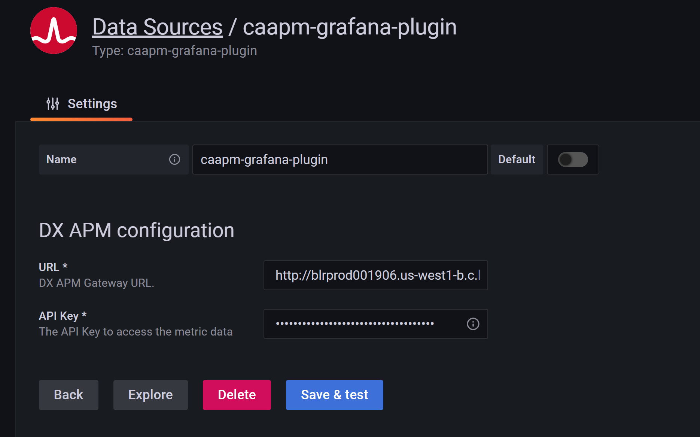
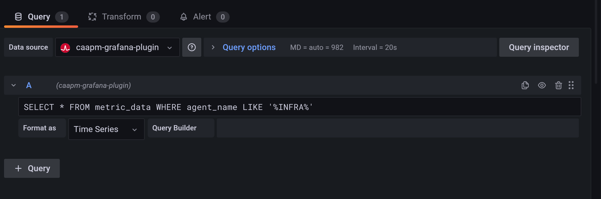

# Classic CA APM Grafana Plugin

# Description
Grafana datasource plugin for DX APM 10.8 (Classic).
Using this plugin you can create dashboards with data from APM 10.x Enterprise Managers usretrieved via the APM SQL REST API.

## Short Description
Grafana datasource plugin for DX APM 10.8 (Classic).

## APM version
DX APM 10.7 SP3+, 10.8 and SaaS
## Supported third party versions
Grafana 7.5.5+

## Limitations
1. This Grafana data source plugin uses the APM SQL REST API to query APM metrics to be comaptible with both APM 10.7 and 10.8 (APM Classic), APM 2x.x on-premise and APM SaaS. If you do not need to access APM 10.x please use another plugin.
1. The APM SQL REST API doesn't support frequency parameter, hence each metric reports at 15s interval. Therefore, querying bigger intervals (time ranges) will return a huge number of data points.
2. Currently we support a limit, querying huge amounts of data can impact your APM Enterprise Managers.
3. We recommend to limit the memory and CPU used by changing these properties:
```
introscope.enterprisemanager.restapi.sql.connectionLimit=5
introscope.enterprisemanager.restapi.sql.groupCountLimit=5
introscope.public.restapi.maxConcurrentRequestsClamp=20
```


## License
[Apache License v 2.0](LICENSE)

# Installation Instructions

## Dependencies
DX APM 10.7 or 10.8

## Installation

1. Download Grafana 7.5.5 and 7.5.5+ verison from <https://grafana.com/grafana/download>
2. Find attached caapm-grafana-plugin.zip, extract to `GRAFANA_HOME\data\plugins` as shown below.
   > **&#9432;** If you cannot find the directory `GRAFANA_HOME\data\plugins` then stop and start Grafana server or create the directory manually with `mkdir -p GRAFANA_HOME\data\plugins`

## Configuration
1. Modify `GRAFANA_HOME\conf\defaults.ini` to include below changes.
   1. In `defaults.ini` file find and update the dataproxy section update below:

      ```
      [dataproxy]
      timeout=120
      dialTimeout=20
      ```

   2. In `defaults.ini` file find and update the plugins section update below.

      ```
      [plugins]
      allow_loading_unsigned_plugins=broadcom-caapm-grafana-plugin
      ````

2. Restart Grafana server
3. Configure DX-APM Gateway URL and DX-APM tenant token as shown below. Plugin provides help url how to create tenant token.

4. If you have a corporate http proxy for grafana server to reach DX-APM gateway then edit `/etc/sysconfig/grafana-server` as shown below and restart Grafana server

   ```
   HTTP_PROXY=PROXY_HOST_NAME:PROXY_PORT
   HTTPS_PROXY=PROXY_HOST_NAME:PROXY_PORT
   ```

# Usage Instructions

You can create a query like this:


## Support
This document and associated tools are made available from Broadcom, Inc. as examples and provided at no charge as a courtesy to the DX APM Community at large. This resource may require modification for use in your environment. However, please note that this resource is not supported by Broadcom, Inc., and inclusion in this site should not be construed to be an endorsement or recommendation by Broadcom, Inc.. These utilities are not covered by the Broadcom, Inc. software license agreement and there is no explicit or implied warranty from Broadcom, Inc.. They can be used and distributed freely amongst the DX APM Community, but not sold. As such, they are unsupported software, provided as is without warranty of any kind, express or implied, including but not limited to warranties of merchantability and fitness for a particular purpose. Broadcom, Inc. does not warrant that this resource will meet your requirements or that the operation of the resource will be uninterrupted or error free or that any defects will be corrected. The use of this resource implies that you understand and agree to the terms listed herein.

Although these utilities are unsupported, please let us know if you have any problems or questions by adding a comment to the DX APM Community Site area where the resource is located, so that the Author(s) may attempt to address the issue or question.

Unless explicitly stated otherwise this extension is only supported on the same platforms as the APM core agent. See [APM Compatibility Guide](https://support.broadcom.com/web/ecx/support-content-notification/-/external/content/release-announcements/CA-Application-Performance-Management-Compatibility-Guides/2146?r=2&r=1&r=1&r=1).

### Support URL
<https://github.com/CA-APM/Classic-CA-APM-Plugin/issues>

# Change log
Changes for each version of the extension.

Version | Author | Comment
--------|--------|--------
1.0 | Broadcom | First version of the extension.
1.1 | Broadcom | fixes, top n, field mapping, variable support
